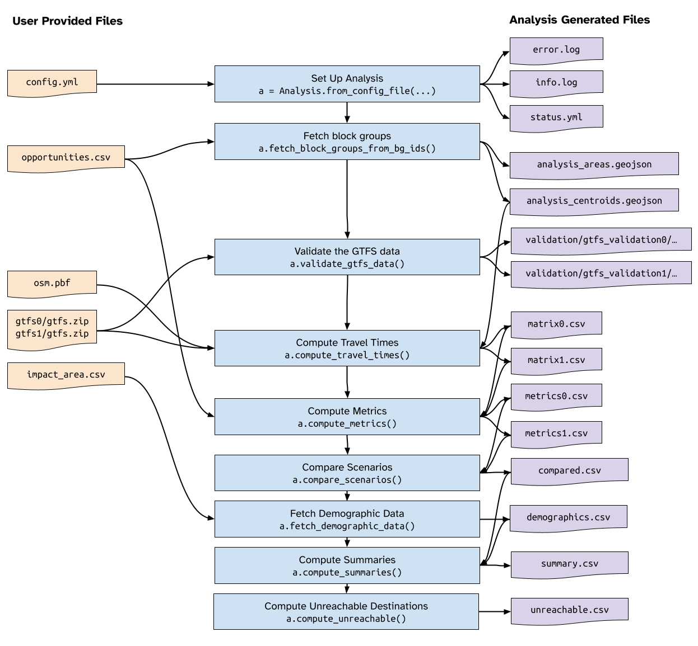

.. _devref:

Developer Reference
===================

This reference contains information about the design and code structure of
TESCA. It is intended as a guide to help future development of the project.

There are two main sections to the code: The analysis engine (contained in
`tesca`, primarly in `tesca.Analysis`) which contains a series of methods to set
up and anlayze travel times and accessibility, and a web application which
gathers inputs to generate configuration settings for the analysis, execute the
analysis, and report on the output.

We discuss first the underlying analysis application, followed by a discussion
of the design of the web tool.

Analysis Engine
---------------

Project Structure
^^^^^^^^^^^^^^^^^
Each individual project lives in a folder inside the ``cache`` folder, and is assigned an ID
based on the time of creation of the project. Here's a rough example of the folder
structure *before* an analysis is run::

    cache
    ├── 20230822141413
    |    ├── gtfs0
    │    │    ├── cta.zip
    │    │    └── metra.zip
    │    ├── gtfs1
    │    │    ├── cta.zip
    │    │    └── metra.zip
    |    ├── validation
    │    ├── config.yml
    │    ├── impact_area.csv
    │    ├── opportunities.csv
    │    ├── osm.pbf

Using these input files, the analysis runs through a series of methods and
produces a number of files in the process that are used both as interim outputs
as well as final visualizaitons. The diagram below illustrates the basic
workflow and file input and output flow. A description of the input data is
detailed in the :ref:`user guide <runanalysis>`.

Here's a description of each file:

Input Files
+++++++++++

- ``config.yml`` contains the prepared analysis configuration settings,
  including things like maximum travel time, modes, and metadata about the
  analysis for reporting.

- ``opportunities.csv`` is a file containing a ``bg_id`` column containing block
  groups for all analysis area zones, and a column for each opportunity type
  matching the opportunity keys in the configuration file.

- ``osm.pbf`` is the OpenStreetMap PBF file spanning the analysis area.

- ``gtfs0`` is a folder containing all of the ``.zip`` files of all GTFS data
  used for Scenario A analysis.

- ``gtfs1`` is a folder containing all of the ``.zip`` files of all GTFS data
  used for Scenario B analysis.
 
- ``impact_area.csv`` is a file containing a single column (``bg_id``) with
  block group defintions for the impact area

Created Files
+++++++++++++

- ``error.log`` and ``info.log`` contain error and info messages produced by the
  analysis. ``info.log`` is used to display updates to the user in the web
  applicaiton.

- ``status.yml`` contains information about the current status of the project
  and completion values, used by the web application to udpate the user on the
  applciation status.

- ``analysis_centroids.geojson`` contains geospatial point data of the
  representative centers or centroids of the block group zone. 

- ``analysis_polygons.geojson`` contains geospatial area data of the block group
  zones. This file should contain an ``id`` column with block group IDs.

- ``validation/gtfs_validation0/<agency>/report.html`` contains the HTML
  MobilityData report for the given GTFS feed for a given scenario (0 or 1)

- ``matrix0.csv`` and ``matrix1.csv`` are the travel time matrices generged for
  the two scenarios.

- ``metrics0.csv`` and ``metrics1.csv`` are the metrics (access to opportunity
  computations) computed for the two scenarios.

- ``compared.csv`` is the difference between metrics for the two scenarios
  across all block groups.

- ``demographics.csv`` contain the demographic counts of the population groups
  used in the analysis. These should correspond to the demogrpahic keys listed
  in the configuration file, and should span all impact area zones.

- ``summary.csv`` contains population weighted summary computations across
  demographic groups for the block groups specified in the ``impact_area.csv``.

- ``unreachable.csv`` contains total counts of various population groups who
  cannot reach a given destination in the alotted time. Used for travel time
  measures only.

Configuration File
^^^^^^^^^^^^^^^^^^

The ``config.yml`` contains all the necessary metadata and configuraiton
specificiations to set up and run an analysis. Here the default configuration
file:

.. literalinclude:: example_config.yml
    :language: yaml

R5 and R5py
^^^^^^^^^^^

This analysis engine relies heavily on Conveyals `R5 routing engine
<https://github.com/conveyal/r5>`_ and the Python wrapped for that engine named
`R5py <https://r5py.readthedocs.io/en/stable/>`_. Because these projects (R5py
in particular) are under active development, using the latest version may
introduce breaking changes.

Web Application
---------------

The web application consists of a Python Flask application framework that reads
and writes directly to files and folders within the ``cache`` directory. This
was done for developmental simplicity and because the design of this application
is not intended to scale past one or two simultaneous users. Further development
or scaling of this applicaiton may need to consider a database interface.

The web application workfow follows a similar pattern to the data flow described
above, and is diagrammed below:

The web application uses a combination of JavaScript files, web endpoints, and
API-style endpoints to fetch and display approrpriate data. Because of the
simplicty of the structure, we do not follow any specific RESTful API
convention, however the endpoints are documented below.

URL Endpoints in ``app.py``
^^^^^^^^^^^^^^^^^^^^^^^^^^^

.. http:get:: /
    :noindex:

    Display the start page and opportunties upload form

.. http:post:: /
    :noindex:

    Upload the supplied opportunities data and initalize analysis

.. http:get:: /cache/(path)
    :noindex:

    Retrieve a specific file from the cache folder.

    :query str: The path to the cached object

.. http:get:: /config/(analysis_id)
    :noindex:

    Fetch the configuration file as a JSON object

    :query str: analysis_id (*requried*) The ID of the analysis to fetch the configuration file for

.. http:get:: /configure/(analysis_id)
    :noindex:

    Display the configuration page for the specified analysis
	 
    :query string: analysis_id (*required*) -- The ID of the analysis

.. http:post:: /configure/(analysis_id)
    :noindex:

    Upload the provided data files and initiate validation
	 
    :query string: analysis_id (*required*) -- The ID of the analysis

.. http:get:: /counties
    :noindex:

    Display the page for fetching block group data by county

.. http:post:: /counties
    :noindex:

    Using the submitted form data, fetch the appropriate block group data and
    return to the user to download.

.. http:get:: /delete/(analysis_id)
    :noindex:

    Display a confirmation page for deletion of a project. If the querystring
    ``confirm=yes`` is provided, execute the deletion.

.. http:get:: /info/(analysis_id)
    :noindex:

    Return a JSON dictionary of the information log for the analysis.

    :query string: analysis_id (*required*) -- The analysis id.

.. http:get:: /guide/(file_path)
    :noindex:

    A filepath extension to display documentation

    :query string: file_path (*required*, default ``index.html``) -- The documentation page to view.

.. http:get:: /gtfs/(analysis_id)
    :noindex:

    A summary page of GTFS validation results for a given analysis

    :query string: analysis_id (*required*) -- The analysis ID to view GTFS validation results for

.. http:get:: /projects
    :noindex:

    A page showing a list of projects and their current status

.. http:get:: /results/(analysis_id)
    :noindex:

    View the results report for a given analysis

    :query string: analysis_id (*required*) -- The analysis ID to view the result output for

.. http:get:: /run/(analysis_id)
    :noindex:

    Start the run process or view the current run status. If the ``status.yml``
    file for the analysis indicates the stage is at ``validate`` and the
    ``value`` is 100, then the analysis will be executed. Otherwise the results
    will be displayed.

    :query string: analysis_id (*required*) -- The analysis ID to run or view

.. http:get:: /status/(analysis_id)
    :noindex:

    Fetch a JSON version of the ``status.yml`` file for a given project

    :query string: analysis_id (*required*) -- The analysis ID to fetch the status of

.. http:get:: /validate/(analysis_id)
    :noindex:

    View the status of the validation of a given analysis.

    :query string: analysis_id (*required*) -- The analysis ID to view the validation status of.

Additional Functions in ``app.py``
^^^^^^^^^^^^^^^^^^^^^^^^^^^^^^^^^^

.. automodule:: app
   :members:

Analysis Object Reference
-------------------------

.. automodule:: tesca.analysis
   :members:

Javascript Reference
--------------------

``configure.js``
^^^^^^^^^^^^^^^^
The configuration JS file loads the contextual map and displays centroids. It
contains no additional methods.

``counties.js``
^^^^^^^^^^^^^^^
The counties JavaScript file controls the selection behaviour when picking
counties.

.. js:autofunction:: addSelectedCounties

.. js:autofunction:: checkForAnySelectedCounties

.. js:autofunction:: loadCountyData

.. js:autofunction:: makeAllSelected

.. js:autofunction:: removeSelectedCounties

.. js:autofunction:: stateSelectChanged

``results.js``
^^^^^^^^^^^^^^
In addition to the functions below, the results page initializes two maps (the
results map and the impact area map) with appropriate layers and backgrounds.

.. js:autofunction:: loadCompareData

.. js:autofunction:: loadConfigData

.. js:autofunction:: loadImpactData

.. js:autofunction:: loadSummaryData

.. js:autofunction:: loadUnreachableData

.. js:autofunction:: mapSelectionChanged

.. js:autofunction:: updateLegend

.. js:autofunction:: updateMap

.. js:autofunction:: renderGroupedBarChart

.. js:autofunction:: blockGroupStyleDefault

.. js:autofunction:: impactBlockGroupDefault

.. js:autofunction:: styleNumbers

.. js:autofunction:: getTravelTimeDeltaColor

.. js:autofunction:: getPercentDeltaColor

.. js:autofunction:: resizeTextAreas

.. js:autofunction:: toggleEditMode

.. js:autofunction:: getOrdinal

``run.js`` and ``validate.js``
^^^^^^^^^^^^^^^^^^^^^^^^^^^^^^

These two files contain the same two methods, repeated here:

.. js:autofunction:: run.updateLogTable

.. js:autofunction:: run.updateStatusMessage

.. js:autofunction:: validate.updateLogTable

.. js:autofunction:: validate.updateStatusMessage

